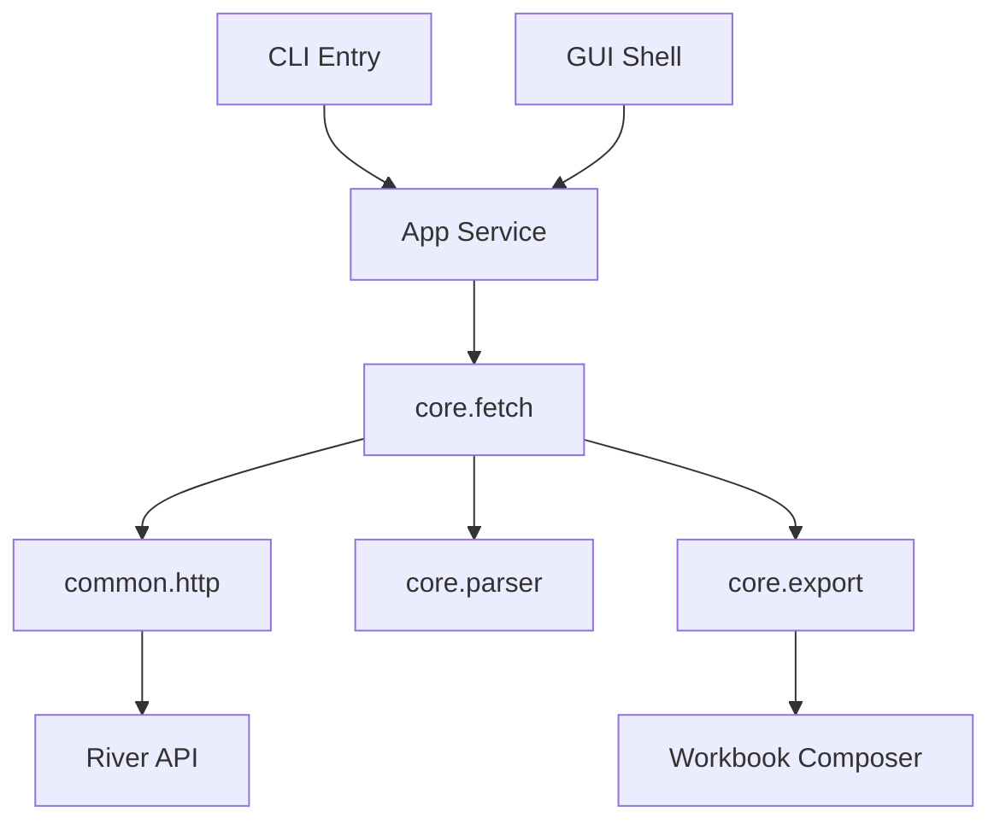
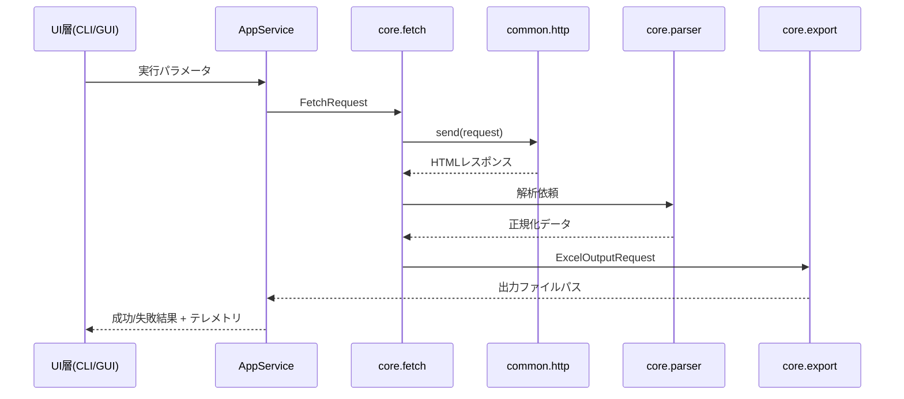

# Design Document

## Overview
本リファクタリングでは、Water-Info-Acquirer の `src` 配下をUI層（CLI/Tkinter）、アプリケーションサービス層、ドメイン処理層、共通インフラ層に整理し直し、将来の機能追加やテスト自動化を容易にする。目標は、既存 `WWRApp` に集中した処理を疎結合なモジュール群に再配置し、HTTPアクセス・データ加工・Excel出力の責務境界を明示することである。
ユーザー（CLI利用者、GUIオペレーター、保守開発者）は統一されたエントリポイントと安定したデータ取得を享受できる。影響範囲は `src/main_datetime.py`, `src/datemode.py`, `src/__main__.py`, `scripts/` 配下の補助ツールであり、アプリ全体のビルド／配布手順は維持する。

### Goals
- 要件1〜4で示された層分離・HTTP共通化・データ加工API・エントリ／テレメトリ統一を満たす
- UI差異に依存しないアプリケーションサービス API を定義する
- HTTP待機・リトライ・ログ方針を単一点で設定可能にする

### Non-Goals
- PyInstaller 配布方式そのものの変更
- GUIデザイン（見た目）の刷新
- 新規ハイドログラフ機能などドメイン要件拡張

## Architecture

### Existing Architecture Analysis
- `WWRApp` がGUI、期間バリデーション、HTTPアクセスを同一クラスで処理
- CLIは `src/__main__.py` から `process_data_for_code` を直接呼ぶため、中間層が存在しない
- `throttled_get` は `src/datemode.py` 内にあり、設定や例外契約が分散
- `.kiro/steering` が存在しないため、本設計で社内標準を定義する必要がある

### Architecture Pattern & Boundary Map
**Selected pattern:** レイヤード+ポート/アダプタ。UI層→アプリサービス→ドメイン→インフラの単方向依存を強制する。

- **Domain boundaries**: `core.fetch` が期間計算とデータ取得を担当、`core.export` がExcel生成。`common.http` が待機・ロギング。
- **New components**: `AppService`（ユースケース調停）、`TelemetryService`（ログ／診断イベント）、`ConfigProvider`（HTTP/Excel設定）。
- **Steering compliance**: 内部で標準を定義し、型ヒントと例外クラスを公開する。

### Technology Stack
| Layer | Choice / Version | Role | Notes |
|-------|------------------|------|-------|
| UI (CLI) | Python argparse / click互換API | CLI起動・引数検証 | 既存 `src/__main__.py` を薄いラッパに変更 |
| UI (GUI) | Tkinter (標準) | 画面イベントとAppService呼び出し | 遅延import維持 |
| App Service | Python 3.12, dataclasses | 入力検証・ユースケース管理 | CLI/GUI共通API |
| HTTP | requests 2.32 + custom ThrottledClient | 待機・リトライ・ヘッダー共通化 | 設定をdataclass + JSONから注入可能に |
| Parsing | BeautifulSoup4, pandas | HTML解析と時系列整理 | 遅延ロードを `core.parser` 内に封じ込め |
| Export | pandas + XlsxWriter | Excelテンプレート生成 | 1/多シートを設定で切替 |
| Telemetry | logging / custom sink | 実行結果と失敗情報 | CLI/GUI双方で共通整形 |

## System Flows

フローではAppServiceが唯一のユースケース窓口となり、UI別の処理分岐はAppService内の入力整形に限定する。

## Requirements Traceability
| Requirement | Summary | Components | Interfaces | Flows |
|-------------|---------|------------|------------|-------|
| 1.1 | 層構成を明示する | AppService, core.fetch, core.export | `FetchRequest`, `ExportRequest` | 図1
| 1.2 | 新規ドメイン機能を独立配置 | AppService, core.* | `UseCase.execute()` | 図1
| 1.3 | 依存方向の矯正 | Architecture Boundary | 層間インタフェース | 図1
| 1.4 | 責務移設証跡 | TelemetryService | `AuditLog` | Sequence
| 2.1 | 共通HTTPヘッダー | common.http | `ThrottledClient.send()` | Sequence
| 2.2 | 待機・リトライ | common.http | RetryPolicy | Sequence
| 2.3 | エラー通知 | common.http, TelemetryService | `HttpError` | Sequence
| 2.4 | スレッドセーフ管理 | common.http | `RequestBudget` | Sequence
| 3.1 | API化 | core.fetch/export | `FetchService`, `ExportService` | Sequence
| 3.2 | 設定尊重 | AppService | `ExecutionOptions` | Sequence
| 3.3 | 例外通知 | TelemetryService | `DomainError` | Sequence
| 3.4 | テストモード拡張 | core.fetch | `DataProvider` | -
| 4.1 | 起動統一 | CLI Entry, GUI Shell | `ExecutionOptions` | -
| 4.2 | バリデーション表示 | AppService, UI層 | `ValidationResult` | -
| 4.3 | 診断ログ | TelemetryService | `TelemetryEvent` | Sequence
| 4.4 | 進捗通知 | GUI Shell, TelemetryService | `ProgressSignal` | Sequence

## Components and Interfaces

### Summary Table
| Component | Layer | Intent | Requirements | Dependencies | Contracts |
|-----------|-------|--------|--------------|--------------|-----------|
| CLIEntry | UI | `python main.py` で引数を受け付けAppServiceへ委譲 | 4.1,4.2 | AppService | `ExecutionOptions`, `ResultSummary` |
| GUIShell | UI | TkinterイベントからAppServiceを呼び出し、進捗を描画 | 4.1,4.4 | AppService, TelemetryService | `ProgressSignal` |
| AppService | Application | 入力検証、Fetch/Export orchestration | 1.*,3.*,4.* | FetchService, ExportService, TelemetryService | `ExecutionOptions`, `UseCaseResult` |
| FetchService (`core.fetch`) | Domain | URL生成、HTTP呼び出し、正規化 | 1.*,2.*,3.* | ThrottledClient, Parser, CalendarUtil | `FetchRequest`, `FetchResponse` |
| ExportService (`core.export`) | Domain | pandas→Excel の組版 | 3.*,4.3 | WorkbookComposer | `ExportRequest`, `ExportResult` |
| ThrottledClient (`common.http`) | Infrastructure | 待機＋ログ＋例外整形 | 2.* | requests | `send(request)` |
| TelemetryService | Cross-cutting | 実行ログ、診断、GUI通知 | 1.4,2.3,4.2-4.4 | logging, queue | `TelemetryEvent`, `ProgressSignal` |
| WorkbookComposer | Infrastructure | XlsxWriterテンプレート操作 | 3.* | pandas, xlsxwriter | `WorkbookSpec` |

### CLIEntry
- **Interfaces**: `def run(argv: Sequence[str]) -> ResultSummary`
- **Behavior**: 引数を `ExecutionOptions` に変換しAppServiceへ渡す。ヘルプ/バリデーション結果を標準出力へ整形。
- **Errors**: `ValidationError` を捕捉して exit code 2 を返す。

### GUIShell
- **Interfaces**: `class GUIShell(Tk)` with methods `start()`, `on_execute(options: ExecutionOptions)`
- **Behavior**: UIイベントをFutureに乗せ、AppServiceをバックグラウンドで呼び出し、TelemetryService経由の進捗を受信。
- **Errors**: DomainError をモーダル表示。

### AppService
- **Interfaces**: `class AppService: def execute(options: ExecutionOptions) -> UseCaseResult`
- **Behavior**: 入力検証→FetchService呼び出し→ExportService→TelemetryService通知。テストモードでは`DataProvider`差し替え。
- **Contracts**: options は型ヒント付き dataclass（期間、モード、シングルシート、有無）。

### FetchService
- **Interfaces**: `def fetch(request: FetchRequest) -> FetchResponse`
- **Behavior**: 月リスト生成、URL組立、ThrottledClientを介してHTML取得、Parserに委譲、ドメインイベントをTelemetryへ送信。
- **Errors**: `DataUnavailableError`, `HttpError`。

### ExportService / WorkbookComposer
- **Interfaces**: `def export(data: FetchResponse, options: ExportOptions) -> ExportResult`
- **Behavior**: pandas DataFrame化、テンプレートに応じたXlsxWriter操作、`single_sheet`設定尊重。
- **Errors**: `EmptyExcelWarning` を保持しつつユーザーフレンドリーなメッセージを返す。

### ThrottledClient
- **Interfaces**: `class ThrottledClient: def send(request: HttpRequest) -> HttpResponse`
- **Behavior**: `RetryPolicy`（最小待機、ステップ、最大値、試行回数）を受け取り、429/5xx時に指数バックオフ。ログはTelemetryServiceへEvent発行。
- **Concurrency**: `RequestBudget`（カウンタ＋Lock）でスレッドセーフに待機時間を決定。

### TelemetryService
- **Interfaces**: `def emit(event: TelemetryEvent) -> None`
- **Behavior**: CLI向けはlogging、GUI向けはqueue + Tk event で通知。イベント型：`Start`, `Progress`, `Success`, `Failure`。

## Data Models
- `ExecutionOptions`: dataclass {codes: list[str], period_start/end: date, single_sheet: bool, use_daily: bool}
- `FetchRequest`: {code, period, mode, granularity}
- `FetchResponse`: {station_meta, records: list[HourlyRecord], coverage}
- `HourlyRecord`: {timestamp: datetime, value: Optional[float]}
- `ExportOptions`: {single_sheet: bool, template: Literal['WH','QD','RD']}
- `TelemetryEvent`: tagged union for Start/Progress/Success/Failure with payloads

## Observability & Telemetry
- CLI/GUI共通のログフォーマット: `[WWR][context] message` を TelemetryServiceで集中管理
- HTTPレイヤは `HttpEvent(start_time, url, retry_count)` を発行し、失敗時はAppServiceで捕捉
- 進捗イベントはGUIのqueue経由でUIスレッドに戻し、CLIでは標準出力へ整形

## Migration Strategy
1. `common.http.ThrottledClient` を既存関数から切り出し差し替え
2. `core.fetch` と `core.export` を作成し、既存 `process_data_for_code` を薄くする
3. `AppService` と `ExecutionOptions` を導入してCLI/GUIから利用
4. TelemetryServiceを適用し、旧ログ呼び出しを置換
5. 最後に `WWRApp` を `GUIShell` 実装へ移行

## Risks & Mitigations
- **リグレッション**: 並列データ取得の差異 → 単体テスト＋オンラインスモークテストをCI化
- **パフォーマンス**: 追加レイヤーによる遅延 → 遅延importと`__all__`制御で最小化
- **学習コスト**: 新しいモジュール構成 → design.md と research.md を開発標準として共有

## Open Questions
- Telemetryイベントの永続化有無（現段階はメモリ内）
- HTTP設定の外部ファイル化（将来の設定画面対応次第）

## References
- `research.md`
- Repository code: `src/main_datetime.py`, `src/datemode.py`
