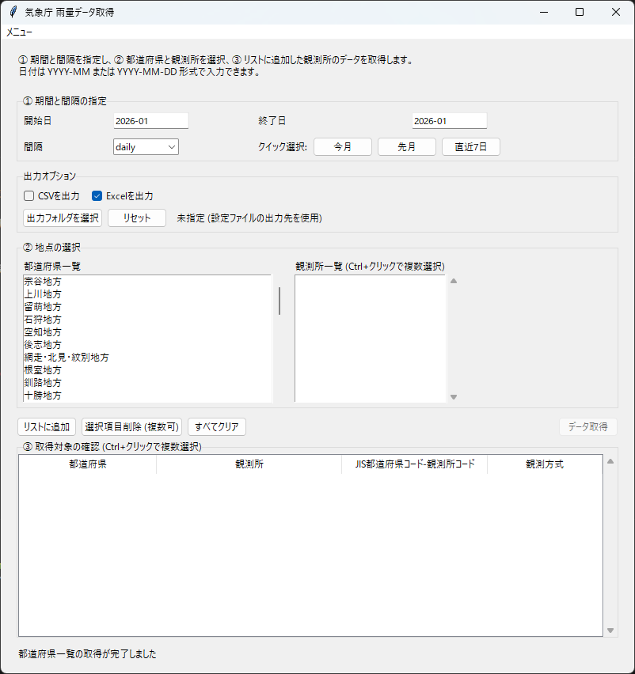

# 気象庁 雨量データ取得

気象庁の雨量データを取得し、CSV/Excelで出力します。

### 起動画面

## 基本の使い方

1. **① 期間と間隔の指定**
   - 開始日/終了日を入力します（`YYYY-MM` または `YYYY-MM-DD`）。
   - 間隔（`daily` / `hourly` / `10min`）を選択します。
   - クイック選択（今月/先月/直近7日）も利用できます。
2. **出力オプション**
   - **CSVを出力 / Excelを出力** を選択します（初期状態は Excel が有効）。
   - 必要に応じて **出力フォルダを選択** で保存先のベースフォルダを指定します。
3. **② 地点の選択**
   - 都道府県を選択し、観測所一覧から対象を選びます（Ctrl+クリックで複数選択可）。
   - **リストに追加** を押して、取得対象（③）に追加します。
4. **データ取得**
   - 取得対象が1件以上あると **データ取得** ボタンが有効になります。押して完了を待ちます。

!!! note "起動直後の読み込み"
    都道府県一覧は起動後に取得するため、最初はリスト上に **「読み込み中…」** と表示されます（通信状況で時間が変わります）。

## 出力先

- 既定の出力先は設定ファイル（`src/jma_rainfall_pipeline/config.yml`）の値に従います。
  - 例: `jma/csv`, `jma/excel`, `jma/logs/app.log`
- 画面で **出力フォルダを選択** した場合は、選択したフォルダ配下に `csv/`, `excel/`, `logs/` を作成して出力します。

