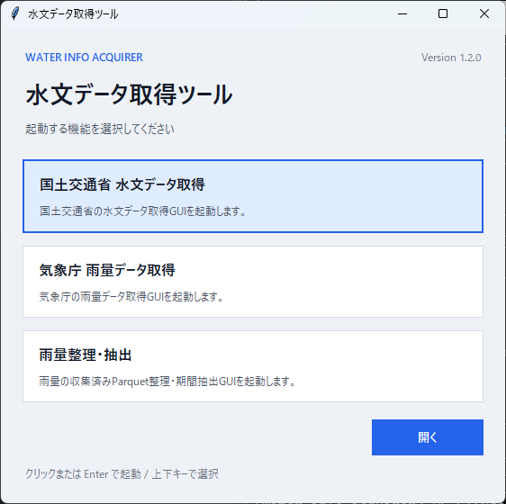

# ランチャー

起動すると「ランチャー」画面が表示され、次のアプリを選択できます。

- **国交省 水文データ取得**
- **気象庁 雨量データ取得**
- **雨量整理・抽出**

## 画面遷移

- 各アプリの上部 **「メニュー」** からランチャーへ戻れます。
- 各アプリの **「ヘルプ」** から公開ドキュメントを開けます。
- アプリのウィンドウを閉じると、ツール全体が終了します。
