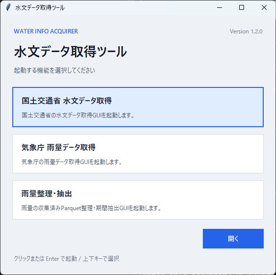

# ランチャー

起動すると「ランチャー」画面が表示され、次のアプリを選択できます。

- **国交省 水文データ取得**
- **水文統計（位況・流況）**
- **気象庁 雨量データ取得**
- **雨量整理・抽出**

「水文統計（位況・流況）」では、取得済みの時間データ（`_H`）と任意の日データ（`_D`）を指定して、位況または流況を算定できます。データの取得は「国交省 水文データ取得」で先に行ってください。

## 画面遷移

- 各アプリの上部 **「メニュー」** からランチャーへ戻れます。
- 各アプリの **「ヘルプ」** から公開ドキュメントを開けます。
- アプリのウィンドウを閉じると、ツール全体が終了します。
