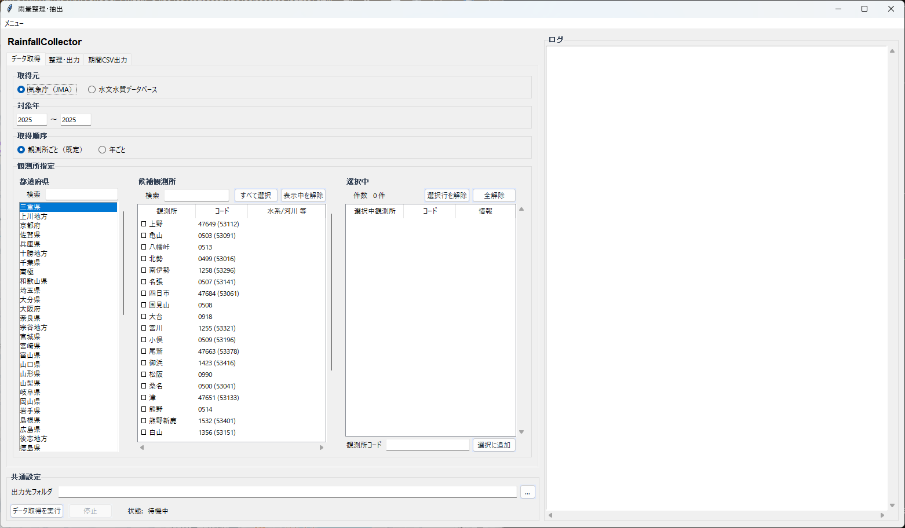
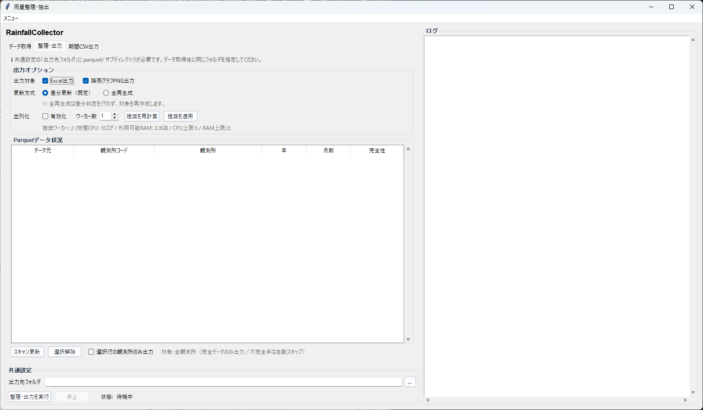
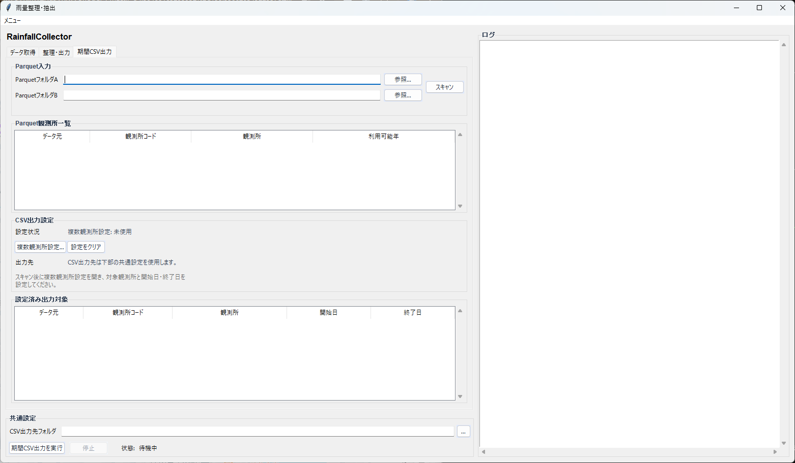

# 雨量整理・抽出

収集済みの雨量 Parquet を使って、次の 3 つを行う画面です。

- JMA / 水文水質DB から時間雨量を収集して Parquet 化
- Parquet から Excel / グラフを整理出力
- 観測所ごとの期間 CSV を抽出

## 画面構成

### データ取得

このタブでは、取得元、対象年、観測所を選択して Parquet を作成します。

- **取得元**: `気象庁（JMA）` / `水文水質データベース`
- **対象年**: 開始年〜終了年
- **取得順序**: 観測所ごと / 年ごと
- **観測所指定**: 都道府県と観測所一覧から選択、またはコード直接入力

### 整理・出力

このタブでは、既に作成済みの Parquet をスキャンして Excel やグラフを出力します。

- **出力対象**: Excel / 降雨グラフPNG
- **更新方式**: 差分更新 / 全再生成
- **並列化**: ワーカー数を指定して整理・出力を並列化
- **Parquetデータ状況**: 観測所・年・完全性を一覧表示
- **選択行の観測所のみ出力**: 一部の観測所だけを対象にしたい時に使用

### 期間CSV出力

このタブでは、Parquet から指定期間の CSV を観測所ごとに出力します。

- **ParquetフォルダA/B**: 入力元の Parquet を指定
- **スキャン**: 利用可能な観測所と年を一覧化
- **複数観測所設定**: 出力対象・開始日・終了日を設定

## 複数観測所設定の使い方

1. Parquet をスキャンする
2. **複数観測所設定...** を開く
3. 左の一覧から観測所を追加する
4. 右の **出力対象設定** で対象行を選択する
5. 下の開始日 / 終了日を指定して **日付を反映**
6. **OK** で確定する

### CSV読込

設定 CSV は **CSV読込** から取り込めます。

- **置換**: 現在の一覧を CSV の内容で置き換える
- **追加**: 現在の一覧を残したまま CSV を追加する

同じ観測所でも **期間が違う行は別行として保持** されます。

### 複数選択

出力対象設定では複数行を選択できます。

- 複数行選択時は、選択した観測所に **共通する利用可能年** だけが年候補に出ます
- **日付を反映** は選択中の全行に同じ開始日 / 終了日を適用します

## 出力先

- データ取得 / 整理・出力: 下部の **出力先フォルダ**
- 期間CSV出力: 下部の **CSV出力先フォルダ**

## よくある注意点

- Parquet が無い状態では整理・出力や期間 CSV 抽出はできません
- 期間 CSV の設定 CSV は、開始日 / 終了日が必須です
- 共通年がない観測所を複数選択した場合、日付反映はできません
