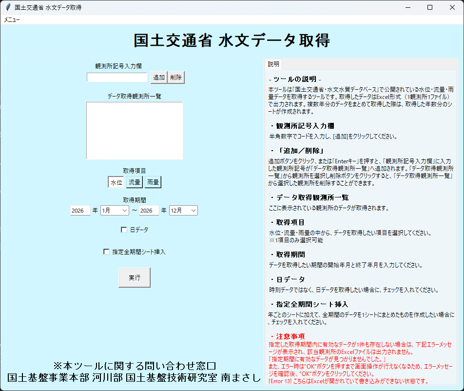

# 国土交通省 水文データ取得

国土交通省「水文水質データベース」で公開されている **水位・流量・雨量** を取得し、**Excel（1観測所=1ファイル）** に出力します。

### 起動画面

## 基本の使い方

1. **観測所記号入力欄** に半角数字でコードを入力し、**追加**（または Enter）で一覧に追加します。
2. **取得項目**（水位/流量/雨量）を選択します（1項目のみ）。
3. **取得期間**（開始年月〜終了年月）を指定します。
4. 必要に応じてオプションを設定します。
5. **実行** を押して完了を待ちます。

## オプション

- **日データ**: チェックすると、時刻データではなく日データ（_D系）を取得します。
- **指定全期間シート挿入**: 年ごとのシートに加えて **「全期間」** シートを作成します。

## 出力

- 出力先: `water_info/`
- 命名規則（例）:
  - 時刻データ: `..._WH.xlsx`（水位）/ `..._QH.xlsx`（流量）/ `..._RH.xlsx`（雨量）
  - 日データ: `..._WD.xlsx`（水位）/ `..._QD.xlsx`（流量）/ `..._RD.xlsx`（雨量）

!!! note "観測所名について"
    ファイル名の観測所名は、取得時にページから読み取り（読み仮名は除去）して付与されます。

## よくあるエラー

- **「指定期間に有効なデータが見つかりませんでした。」**  
  指定期間内にデータが存在しない可能性があります。まず短い期間で試してから期間を延ばしてください。
- **`[Error 13]`**  
  出力先のExcelが開かれていて上書きできない状態です。Excelを閉じて再実行してください。

